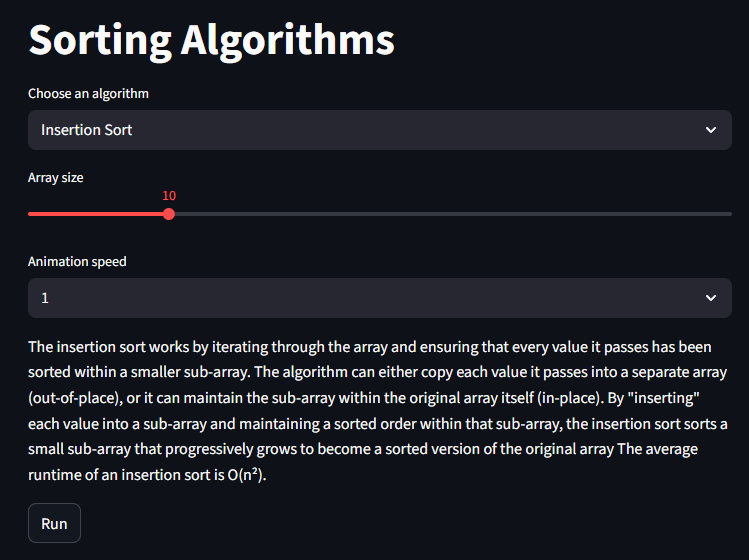
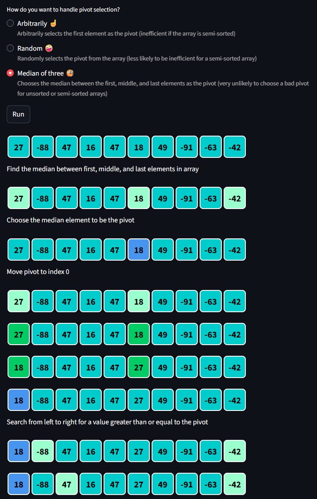
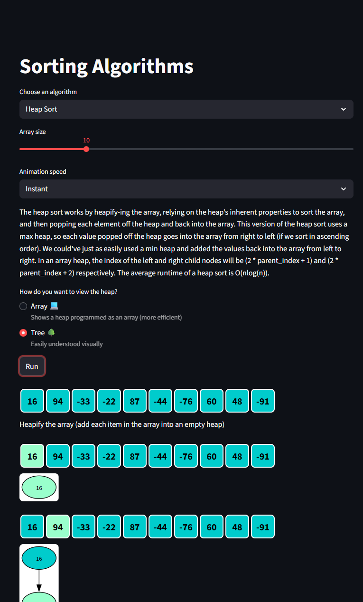
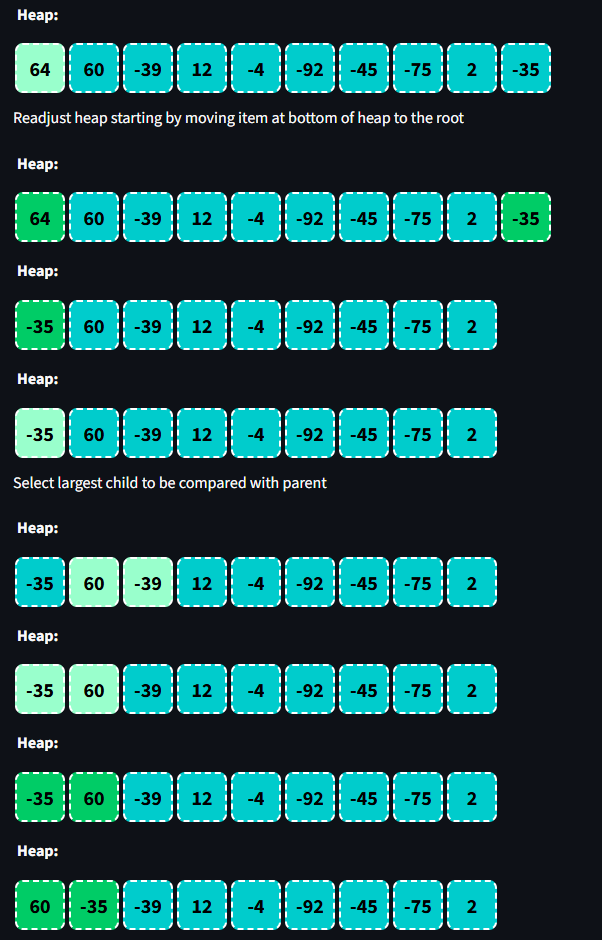
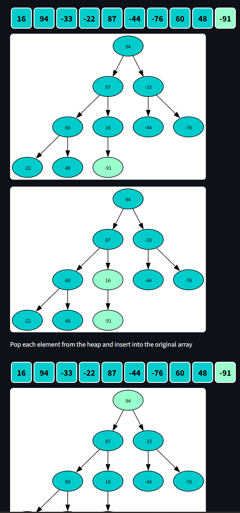

# DSA Visualizer
*A Data Structures and Algorithms Visualizer*

An interactive tool I initially developed to teach common data structures and algorithms to students I tutor. This is a visualization tool built using Python, Matplotlib, and Streamlit. This project is designed for learning or teaching data structures using step-by-step visuals.

## Features

Each algorithm includes a detailed description of how the algorithm works as well as annotations for important steps within the algorithm.

Some algorithms support the option to visualize as an array or as a tree.

This tool currently supports the following algorithms:

- Sorting Algorithms:
    - Selection Sort
    - Bubble Sort
    - Insertion Sort
    - Shell Sort
    - Merge Sort (including a separate module to demonstrate the concept of merging)
    - Heap Sort
    - Quick Sort

- Searching Algorithms:
    - Sequential Search
    - Binary Search

## Planned Updates

- Sorting Algorithms:
    - Radix Sort
    - Insertion Sort using two arrays

- Tree Structures:
  - Binary Search Trees
  - AVL Trees
  - Red-Black Trees
- Graph Algorithms:
  - Breadth-First/Depth-First Search
  - Dijkstra's Algorithm
  - Prim's Algorithm
- Other Data Structures:
  - Linked Lists
  - Stacks/Queues
  - Hash Tables

## Tech Stack

- **Python** 3.12.9
- **Streamlit** 1.50.0 – Interactive UI
- **Matplotlib** 3.10.7 – Visualization and plotting

Dependencies are kept intentionally light to maintain accessibility for students.

## Getting Started

The easiest way to use this project is through the Streamlit Community Cloud by clicking on this link: https://dsa-visualizer-ec2en446yacdpgrm9gcaxu.streamlit.app/

Note: This project will run a bit slower on Streamlit Community Cloud than it will running locally. This is only really a problem when using the "instant" speed setting.

Otherwise, if you'd like to run this project on your own machine, follow the steps below.

### Prerequisites

Python 3.9+ installed

pip package manager

### Installation

Clone the repository:

```bash
git clone https://github.com/JWesP23/DSA-Visualizer
cd DSA-Visualizer
```

### Create a virtual environment (recommended):
Using a virtual environment helps avoid dependency conflicts.

```bash
python -m venv venv
source venv/bin/activate   # macOS/Linux
venv\Scripts\activate      # Windows 
```

### Install dependencies:

```bash
pip install -r requirements.txt
```

### Running the Visualizer

```bash
cd data-structures-visualizer
streamlit run DSA_Visualizer.py
```

The app should open automatically in your default browser.

Use the sidebar to navigate to the desired resources.

## Project Structure
<pre>
DSA-Visualizer/<br>
├── DSA_Visualizer.py   # Application entry point
├── algorithms/         # Where algorithm code is stored
├── data_structures/    # Where data structure representation code will be stored
├── pages/              # Where the main page for each element in the sidebar is stored
├── visuals/            # Where visualization functions are stored
├── screenshots/        # Where the screenshots in this file are stored
├── requirements.txt    # Dependencies
├── README.md           # This file
└── .gitignore          # Git ignore file

</pre>

## License

This project is licensed under the MIT License. See the LICENSE file for details.

## Screenshots

Example of an algorithm description (Insertion Sort):<br>


Example of algorithm visualization (Quick Sort):<br>


Example of options available to visualize some algorithms differently (Heap Sort):<br>


Heap Sort as array:<br>


Heap Sort as Tree:<br>

